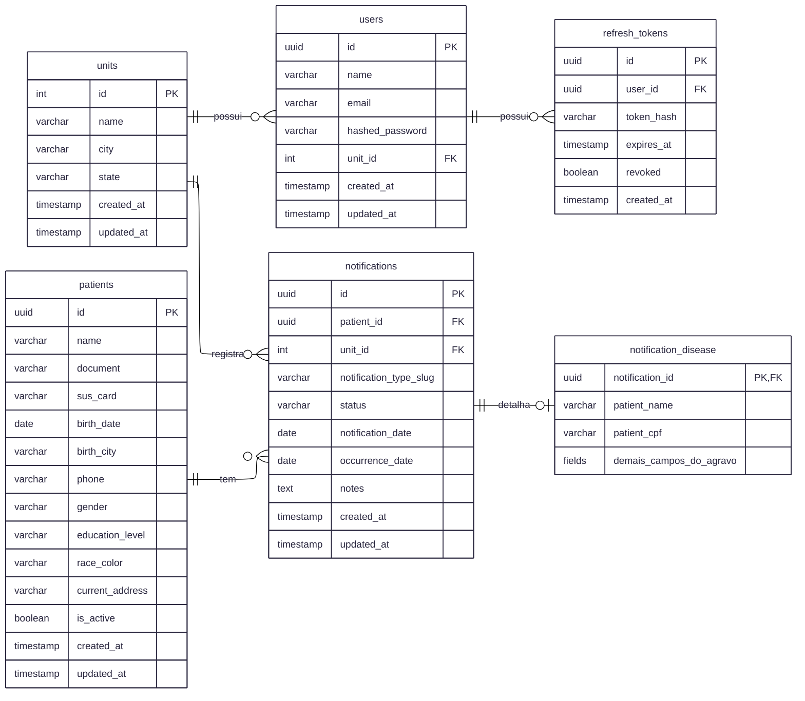

```mermaid
---
config:
  theme: redux
  layout: elk
  elk:
    edgeRouting: ORTHOGONAL
---
erDiagram
    direction LR
    
    units {
        int id PK ""  
        varchar name  ""  
        varchar city  ""  
        varchar state  ""  
        timestamp created_at  ""  
        timestamp updated_at  ""  
    }

    users {
        uuid id PK ""  
        varchar name  ""  
        varchar email  ""  
        varchar hashed_password  ""  
        int unit_id FK ""  
        timestamp created_at  ""  
        timestamp updated_at  ""  
    }

    refresh_tokens {
        uuid id PK ""  
        uuid user_id FK ""  
        varchar token_hash  ""  
        timestamp expires_at  ""  
        boolean revoked  ""  
        timestamp created_at  ""  
    }

    patients {
        uuid id PK ""  
        varchar name  ""  
        varchar document  ""  
        varchar sus_card  ""  
        date birth_date  ""  
        varchar birth_city  ""  
        varchar phone  ""  
        varchar gender  ""  
        varchar education_level  ""  
        varchar race_color  ""  
        varchar current_address  ""  
        boolean is_active  ""  
        timestamp created_at  ""  
        timestamp updated_at  ""  
    }

    notifications {
        uuid id PK ""
        uuid patient_id FK ""
        int unit_id FK ""
        varchar notification_type_slug ""
        varchar status ""
        date notification_date ""
        date occurrence_date ""
        text notes ""
        timestamp created_at ""
        timestamp updated_at ""
    }

	notification_disease {
        uuid notification_id PK,FK ""
        
        %% DADOS DO PACIENTE (Snapshot) - Deixamos visível pois é uma regra de negócio importante
        varchar patient_name ""
        varchar patient_cpf ""
        %% =======================================================================
        %% REPRESENTAÇÃO ABSTRATA: Esta tabela espelha estruturas como 
        %% notification_botulism, notification_dengue, etc.
        %% Os campos abaixo variam de acordo com a ficha específica do SINAN.
        %% =======================================================================

        fields demais_campos_do_agravo ""
    }

	
    units ||--o{ users : "possui"
    users ||--o{ refresh_tokens : "possui"
    patients ||--o{ notifications : "tem"
    units ||--o{ notifications : "registra"

	notifications ||--o| notification_disease: "detalha"

     %% =======================================================================
        %% OS CAMPOS ABAIXO ESTÃO OCULTOS NO DIAGRAMA VISUAL PARA MANTER A LEITURA 
        %% LIMPA, MAS ESTÃO DOCUMENTADOS AQUI NO CÓDIGO-FONTE.
        %% =======================================================================
        
        %% date patient_birth_date ""
        %% varchar sex ""
        %% varchar race_color ""
        %% varchar education_level ""
        %% varchar sus_card_number ""
        %% varchar residence_city ""
        %% varchar residence_state ""
        
        %% 2. DADOS DE ATENDIMENTO
        %% date dt_first_attendance ""
        %% int nu_attendances_until_suspicion ""
        %% date dt_clinical_suspicion ""
        %% varchar st_hospitalization_occurred ""
        %% date dt_hospitalization ""
        %% date dt_hospital_discharge ""
        
        %% 3. SINTOMAS
        %% varchar st_symptoms_fever ""
        %% varchar st_symptoms_nausea ""
        %% varchar st_symptoms_vomiting ""
        %% varchar st_symptoms_diarrhea ""
        %% varchar st_symptoms_constipation ""
        %% varchar st_symptoms_headache ""
        %% varchar st_symptoms_dizziness ""
        %% varchar st_symptoms_blurred_vision ""
        %% varchar st_symptoms_diplopia ""
        %% varchar st_symptoms_dysarthria ""
        %% varchar st_symptoms_dysphonia ""
        %% varchar st_symptoms_dysphagia ""
        %% varchar st_symptoms_dry_mouth ""
        %% varchar st_symptoms_wound ""
        %% varchar st_symptoms_neck_flaccidity ""
        %% varchar st_symptoms_dyspnea ""
        %% varchar st_symptoms_respiratory_failure ""
        %% varchar st_symptoms_heart_failure ""
        %% varchar st_symptoms_coma ""
        %% varchar st_symptoms_paresthesia ""
        %% varchar ds_symptoms_paresthesia_where ""
        %% varchar st_symptoms_other ""
        
        %% 4 e 5. EXAME NEUROLÓGICO E REFLEXOS
        %% varchar st_exam_ptosis ""
        %% varchar st_exam_ophthalmoparesis ""
        %% varchar st_exam_mydriasis ""
        %% varchar st_exam_facial_paralysis ""
        %% varchar st_exam_bulbar_musculature ""
        %% varchar st_exam_upper_limb_weakness ""
        %% varchar st_exam_lower_limb_weakness ""
        %% varchar st_exam_descending_weakness ""
        %% varchar st_exam_symmetric_weakness ""
        %% varchar st_exam_altered_sensitivity ""
        %% varchar st_neurological_reflexes ""
        
        %% 6. FONTE DE TRANSMISSÃO
        %% varchar transmission_source_food ""
        %% varchar ds_transmission_source_food ""
        %% varchar tp_exposure_food ""
        %% varchar st_food_industrial ""
        %% varchar st_food_homemade ""
        %% varchar ds_food_industrial_info ""
        %% varchar st_location_domicile ""
        %% varchar st_location_daycare ""
        %% varchar st_location_work ""
        %% varchar st_location_restaurant ""
        %% varchar st_location_party ""
        %% varchar st_location_other ""
        %% int nu_people_consumed_food ""
        
        %% 7. TRATAMENTO
        %% varchar st_treatment_ventilatory_support ""
        %% varchar st_treatment_antibiotic_therapy ""
        %% varchar st_treatment_antibotulinum_serum ""
        %% date dt_antibotulinum_serum ""
        
        %% 8. EXAMES COMPLEMENTARES
        %% varchar tp_cerebrospinal_fluid ""
        %% date dt_cerebrospinal_fluid_collection ""
        %% int nu_cerebrospinal_fluid_cells ""
        %% int nu_cerebrospinal_fluid_protein ""
        %% varchar st_electroneuromyography ""
        %% date dt_electroneuromyography_date ""
        %% varchar tp_emg_sensitive_neuroconduction ""
        %% varchar tp_emg_motor_neuroconduction ""
        %% varchar tp_emg_repetitive_stimulation ""
        
        %% 9. DADOS LABORATORIAIS
        %% varchar st_botuli_serum_collected ""
        %% date dt_botuli_serum_collection ""
        %% varchar st_botuli_serum_result ""
        %% varchar tp_botuli_serum_toxin ""
        %% varchar st_botuli_feces_collected ""
        %% date dt_botuli_feces_collection ""
        %% varchar st_botuli_feces_result ""
        %% varchar tp_botuli_feces_toxin ""
        %% varchar ds_botuli_food1_info ""
        %% varchar st_botuli_food1_collected ""
        %% date dt_botuli_food1_collection ""
        %% varchar st_botuli_food1_result ""
        %% varchar tp_botuli_food1_toxin ""
        %% varchar ds_botuli_food2_info ""
        %% varchar st_botuli_food2_collected ""
        %% date dt_botuli_food2_collection ""
        %% varchar st_botuli_food2_result ""
        %% varchar tp_botuli_food2_toxin ""
        %% varchar st_botuli_other_collected ""
        %% varchar ds_botuli_other_info ""
        %% date dt_botuli_other_collection ""
        %% varchar st_botuli_other_result ""
        %% varchar tp_botuli_other_toxin ""
        
        %% 10. CONCLUSÃO
        %% varchar tp_final_classification ""
        %% varchar tp_confirmation_criteria ""
        %% varchar tp_botulism ""
        %% varchar tp_case_evolution ""
        %% varchar ds_cause ""
        %% varchar st_work_related_disease ""
        %% date dt_death ""
        %% date dt_closing ""
```